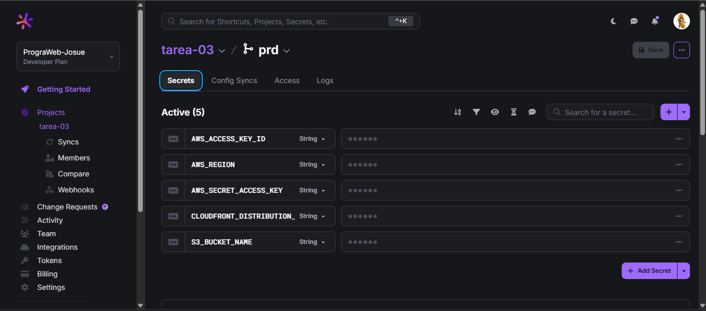

# 📁 Programación Web 💻

## Evidencias Tarea 03 - GitHub Actions & CDN Deployment

1. *Captura de pantalla de la pestaña "Config Syncs" de Doppler*  

    

2. *Captura de pantalla de las variables de Doppler*      

    

3. *Captura de pantalla de los Secretos en GitHub*

    

4. *URL del CDN de CloudFront para la visualización*  

    https://d22tb73aixg5d4.cloudfront.net

## 👨‍💻 Autor

- **Nombre:** Josué Bautista
- **Curso:** Programación Web  
- **Institución:** [Universidad Rafael Landívar](https://principal.url.edu.gt/)
