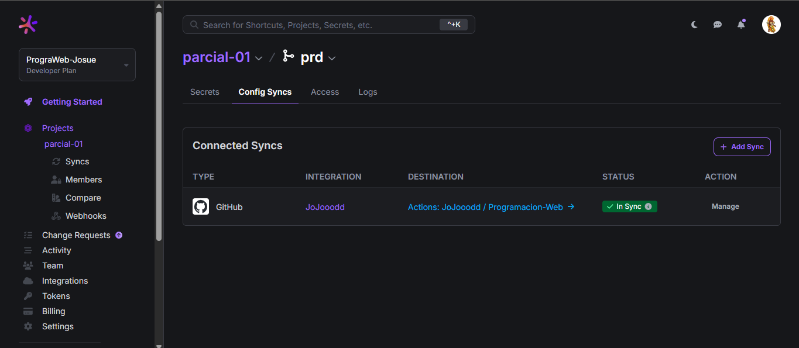
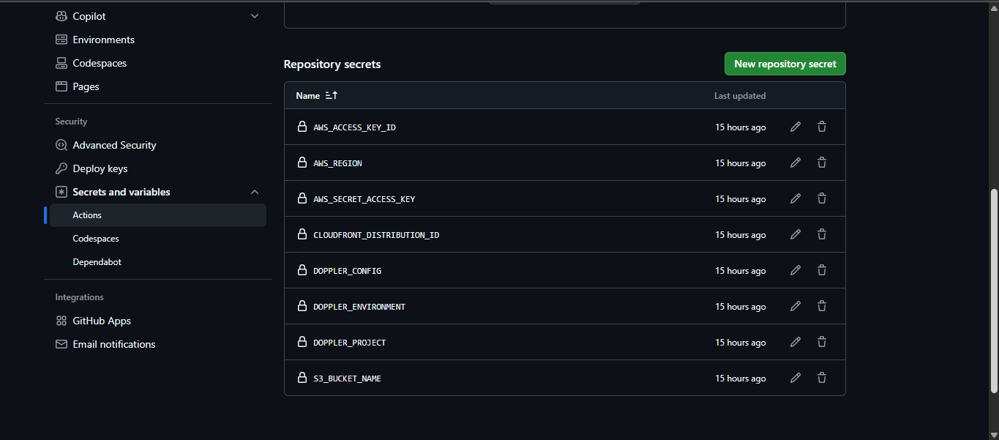
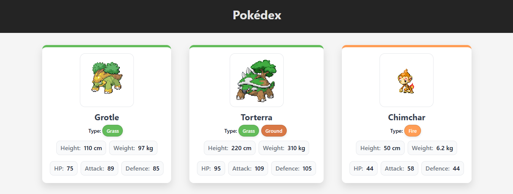
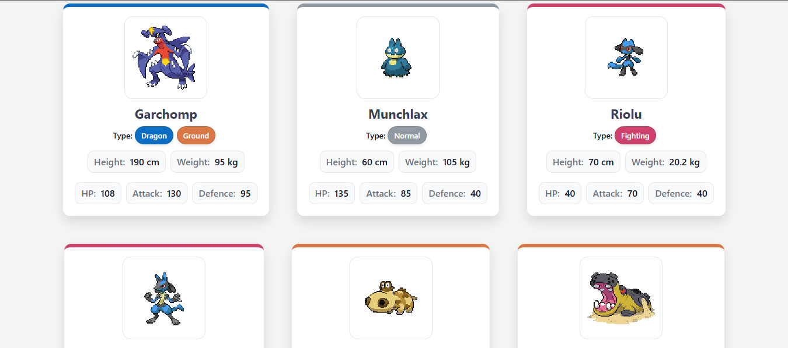

# 📁 Web Programming 💻

## Evidence – Partial Exam 01: Pokedex

### 1. *Screenshot of the "Config Syncs" tab in Doppler*  

### 2. *Screenshot of Doppler environment variables*      

### 3. *Screenshot of GitHub Secrets*

### 4. *Screenshots of the application displaying Pokémon cards*

### CloudFront CDN URL for live preview  

  
   
  <h3>
    <a href="https://d1q1tya2gfotyw.cloudfront.net">https://d1q1tya2gfotyw.cloudfront.net</a>
  </h3>

## 👨‍💻 Author

- **Name:** Josué Bautista
- **Course:** Web Programming
- **Institution:** [Rafael Landívar University](https://principal.url.edu.gt/)
